

---

---

## 🧑‍🔬 About Me

  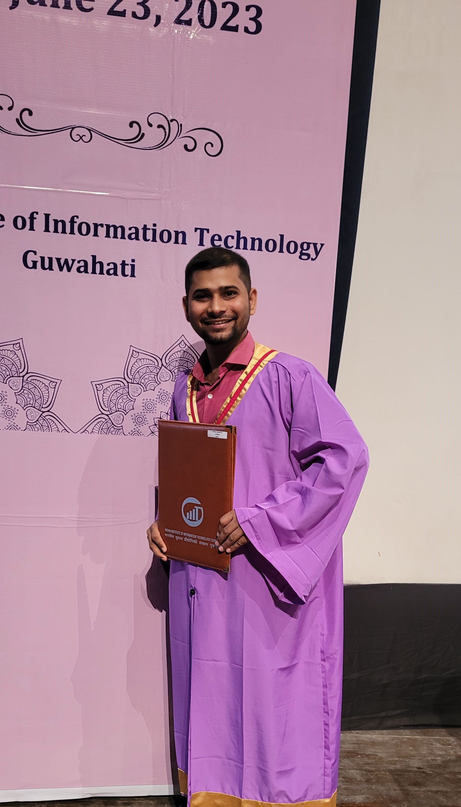

╔══════════════════════════════════════════════════════════════════╗
║  Research Scholar  |  IIT Mandi  |  SCEE Department             ║
║  Focus: Digital VLSI · Post-Quantum Cryptography · RISC-V SoC   ║
║  🏅 Gold Medalist (1st Rank) - M.Tech, IIIT Guwahati            ║
╚══════════════════════════════════════════════════════════════════╝

I build **secure and high-performance hardware systems** — from post-quantum cryptographic accelerators to full custom RISC-V SoC implementations on FPGA and ASIC platforms.

---

## 🔬 Featured Chip Designs & Layouts
*From GDSII fabrication to advanced sub-micron simulations.*

  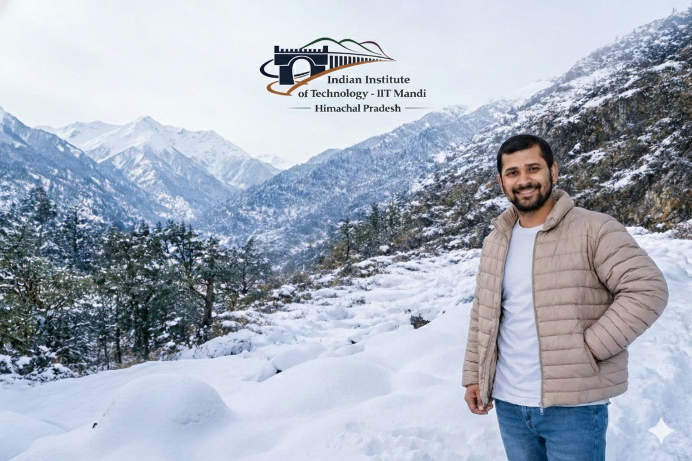

| Technology | Description | Layout Preview |
| :--- | :--- | :--- |
| **GF180nm** | Open-Source ASIC Design | [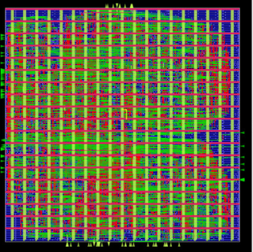](image/Chip2GF180nm.png) |
| **SkyWater 130nm** | RISC-V Based SoC | [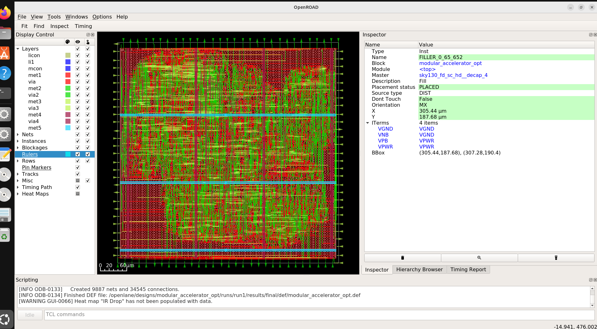](image/chip1skywater130nm.png) |
| **ASAP 7nm** | PQC Hardware Accelerator | [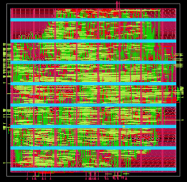](image/chip3ASAPnm.png) |
| **Nangate 45nm** | Standard Cell Implementation | [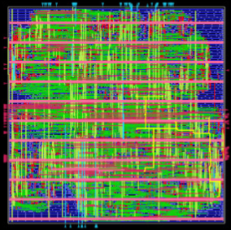](image/chip4nangate45nm.png) |
| **RISC-V SoC** | Complete RISC-V Floorplan |  |

---

## 🛠️ Tech Stack & Skills

**Hardware Design** &nbsp;   

**EDA Tools** &nbsp;    

---

## 📊 GitHub Performance

  
  

  

---

## 📸 Academic & Professional Gallery

  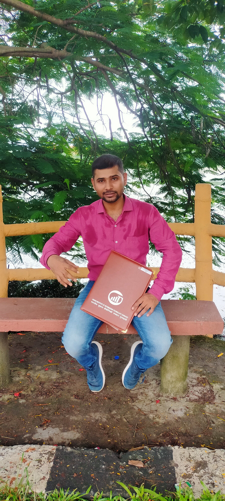
  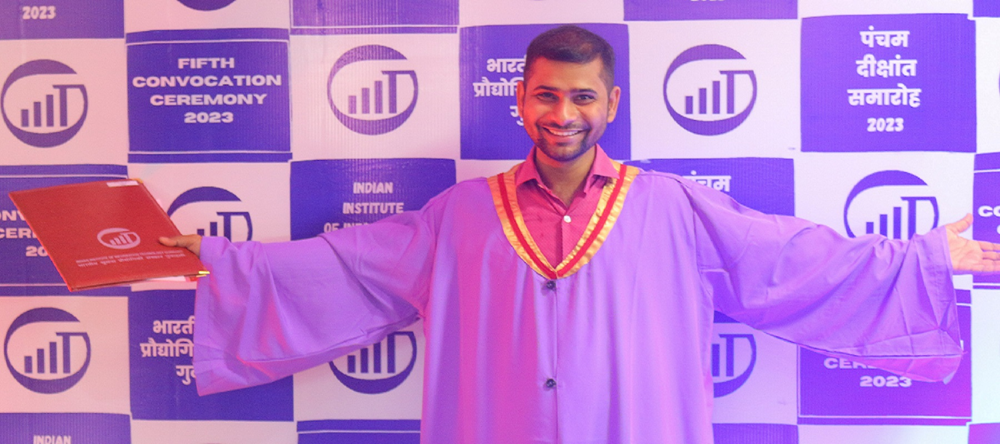
  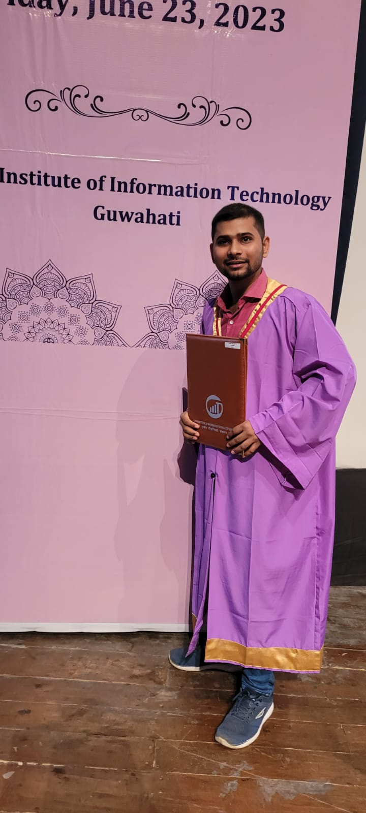

  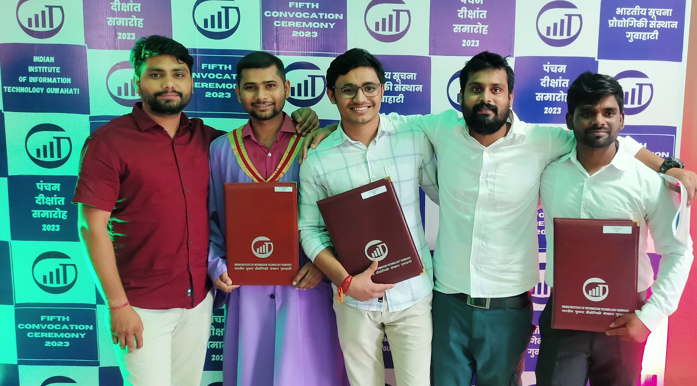
  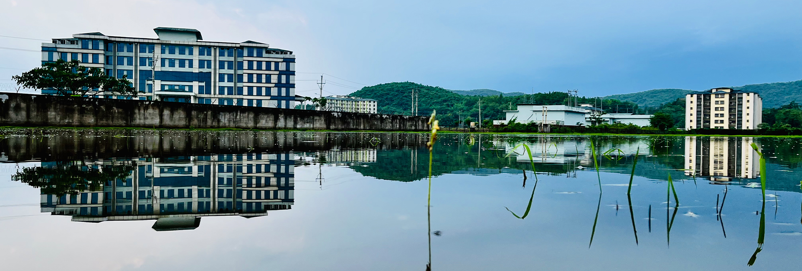
  

---

## 📫 Connect With Me

---

*"Secure hardware is not a feature — it is a foundation."*

